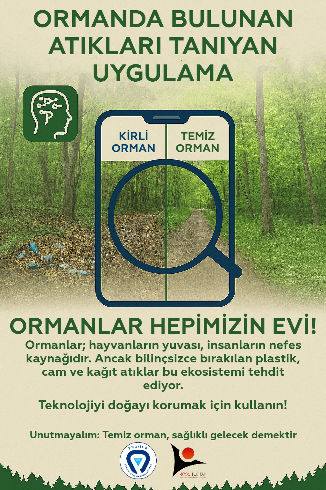

  <!-- Buraya yüklediğiniz fotoğrafın dosya adını ekleyin -->

# Orman Atık Algılama Uygulaması

Bu proje, Teachable Machine kullanarak ormandaki atıkları tanıyıp sınıflandıran bir yapay zeka uygulamasıdır. Model, "Kirli Orman" ve "Temiz Orman" olmak üzere iki sınıf ile çalışmaktadır.

## Geliştirenler

Profilo Mesleki ve Teknik Anadolu Lisesi öğrencileri tarafından hazırlanmıştır.
